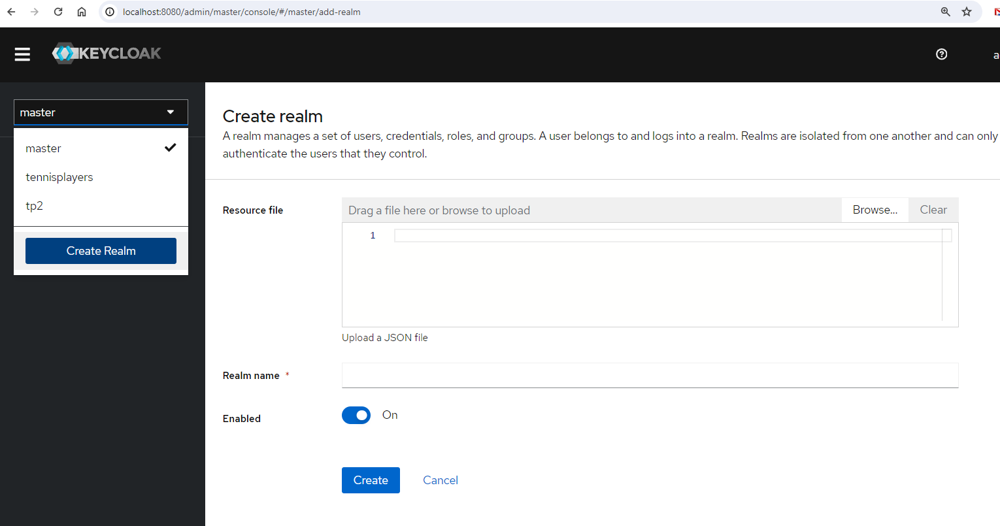

## Keylcoak

Keycloak est un Idp, un Identity Provider.

La meilleure manière d el'utiliser aujourd'hui est en utilisant le protocol OAuth2.
=> https://www.youtube.com/watch?v=YdShQveywpo 


## Montage d'un keycloak

Pour créer un environnement keycloak, le plus simple est d'utiliser un docker compose (ou la commande docker run et de lui envoyer les paramètres, mais pour la suite, docker compose est top).

```docker compose
version: '3'
services:
   dc-keycloak:
    image: quay.io/keycloak/keycloak:22.0.5
    environment:
      KEYCLOAK_LOG_LEVEL: DEBUG
      KEYCLOAK_ADMIN: admin
      KEYCLOAK_ADMIN_PASSWORD: myadminpwd
      KC_PROXY: edge
      KC_PROXY_MODE: edge
      KC_HTTP_ENABLED: true
      KC_HOSTNAME_STRICT: false
      KC_HOSTNAME_PATH: /auth
      KC_HOSTNAME_URL: http://localhost:100/auth
      KC_HOSTNAME_ADMIN_URL: http://localhost:100/auth
    command:
      - start-dev
    volumes:
      - ./volumes/keyckloak:/opt/keycloak/data/h2
```
## Configuration d'un realm
Un realm correspond à un fournisseur d'identité. Keycloak est capable d'héberger de nombreux Idp au travers de nombreux realms. 
Il est également capable de jouer le rôle de broker d'identité (mais ce n'est pas vraiment la question aujourd'hui.)

Il est fourni par défaut avec le realm master qui a pour objectif l'administration de Keycloak. Ce realm ne doit pas être utilisé comme Idp pour votre application.

Il faut par conséquent créer un realm et le configurer, ce qui peut s'avérer pas évident quand on ne sait pas trop quoi configurer et ce d'autant plus que Keycloak
a changé d'interface il y a quelques temps, ce qui complexifie très largement la recherche d'informations sur internet.

### Création d'un realm

=> Dans la liste des realms (en haut à gauche)=> Create realm, spécifier un nom puis cliquer sur create
<div></div>


#### Configuration d'un client
=> Il faut ensuite configurer un client

=> Client type : OpenIdConnect

=> CLientId => celui qui sera utilisé dans dotnet

< next >
=>Config : seul le flow standard nous intéresse

< next > =>Valid redirect URIs et Web Origins =>


Il s'agit de 2 champs très important dans la sécurité => quels sont les sites web sécurisables avec cet Idp

=> Pour plus de simplicité, nous allons simplement mettre '*', mais ce n'est pas une bonne idée en prod.


=> Client scope, ajouter l'audience à partir Add Mapper / By config dans le scope "dedicated"


## Laison de dotnet avec ce realm
Côté dotnet, il faut maintenant mettre en place la gestion de l'identification et de la connexion avec notre idp.

Pour cela, il faut : 
- référencer la bonne bibliothèque : 
- configurer l'idp : je vous donne le code pour plus de simplicité : 
 
```csharp
builder.Services.AddAuthentication(options => {
    options.DefaultScheme = JwtBearerDefaults.AuthenticationScheme;
    options.DefaultChallengeScheme = JwtBearerDefaults.AuthenticationScheme;
    options.DefaultAuthenticateScheme = JwtBearerDefaults.AuthenticationScheme;
}).AddJwtBearer(options => {
    options.Authority = Environment.GetEnvironmentVariable("App_Authority");
    options.Audience = Environment.GetEnvironmentVariable("App_ClientId");
    options.RequireHttpsMetadata = false;
    options.TokenValidationParameters = new Microsoft.IdentityModel.Tokens.TokenValidationParameters() {
        ValidateIssuer = false,
        ValidateAudience= false,
    };
});
```

et petit cadeau bonus, si vous voulez le configurer avec swagger : 
```csharp

builder.Services.AddSwaggerGen(options => {
    var scheme = new OpenApiSecurityScheme {
        In = ParameterLocation.Header,
        Name = "Authorization",
        Flows = new OpenApiOAuthFlows {
            AuthorizationCode = new OpenApiOAuthFlow {
                AuthorizationUrl = new Uri($"{Environment.GetEnvironmentVariable("App_SwaggerAuthority")}/protocol/openid-connect/auth"),
                TokenUrl = new Uri($"{Environment.GetEnvironmentVariable("App_SwaggerAuthority")}/protocol/openid-connect/token")
            }
        },
        Type = SecuritySchemeType.OAuth2
    };
    options.AddSecurityDefinition("OAuth", scheme);
    options.AddSecurityRequirement(new OpenApiSecurityRequirement {
        {
            new OpenApiSecurityScheme {
                Reference = new OpenApiReference {Id = "OAuth", Type = ReferenceType.SecurityScheme }
            },
            new List<string>()
        }
    });
    options.CustomSchemaIds(type => type.ToString());
});
```
## Liaison d'angular avec ce realm
 Côté angular, les mêmes manipulations sont nécessaires, à savoir 
- référencer la bonne bibliothèque : angular-auth-oidc-client
- configurer l'idp : je vous donne le code pour plus de simplicité : 

```javascript

@NgModule({
  declarations: [
    AppComponent,
    PlayersComponent,
    ErrorComponent,
    LoginComponent,
    LandingComponent
  ],
  imports: [
    BrowserModule,
    AppRoutingModule,
    HttpClientModule,
    NgxJsonViewerModule,
    AuthModule.forRoot({
      config: {
        authority: 'http://localhost:100/auth/realms/tennisplayers',
        redirectUrl: window.location.origin + '/postlogin',
        postLogoutRedirectUri: window.location.origin + '/logouterror',
        clientId: 'tennisplayers',
        scope: 'openid profile email offline_access',
        responseType: 'code',
        silentRenew: true,
        useRefreshToken: true,
        logLevel: LogLevel.Debug,
        secureRoutes: ['api', '/api'],
      },
    }),
  ],
  providers: [
    { provide: HTTP_INTERCEPTORS, useClass: AuthInterceptor, multi: true },
  ],
  bootstrap: [AppComponent]
})
export class AppModule { }

```

Dans le fichier app.component.ts
``` javascript
ngOnInit() {
    this.oidcSecurityService.checkAuth().subscribe(({ isAuthenticated, userData}) => {
      console.log('checkauth')
      console.log(isAuthenticated ,userData);
    });
    this.oidcSecurityService.getAccessToken().subscribe({
      next:(at)=> this.token = at,
      error:(err)=> console.log(err),
      complete: ()=>console.log('complete')

    });
  }
```
vous devez ensuite utiliser : 

```javascript
private oidcSecurityService: OidcSecurityService

=> .authorize()
=> .getAccessToken().subscribe({
      next:(at)=> console.log('accesstoken : ' + at),
      error:(err)=> console.log(err),
      complete: ()=>console.log('complete')

    });
```

## Importance du token => montrer tout ce qu'on faire à partir du token
- Utilisation des informations dans la partie dotnet (et la classe IUser)
Pour utiliser le token depuis dotnet, il est bien de faire une classe User, prenant en paramètres IHttpContextAccessor
> il faut pour cela ajouter à program.cs :
```csharp
builder.Services.AddHttpContextAccessor();

```

- Utilisation des informations dans angular
Au travers de jwt_decode, vous avez accès à toutes les informations nécessaires

> Faire une api qui exploite les informations de l'utilisateur

> faire une page qui exploite les informations de l'utilisateur

## Ajout des rôles

La gestion des roles pour gérer les accès (RBAC) peut également être supporter par des Idp tels que Keycloak.

Pour la mise en place : 
- Authorize(Role="")
- Il faut configurer la génération du token (scope dans Keycloak) pour intégrer les rôles dans la propriété roles


